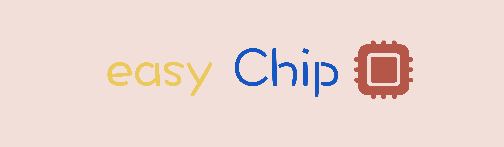

# easyChip



*让嵌入式初始化项目代码更简单～*


## **项目正在开发，相关功能敬请期待～**

[//]: # (## 目录)

[//]: # (1. [如何使用]&#40;#如何使用&#41;)

[//]: # (2. [没有我的MCU型号]&#40;#没有我的MCU型号&#41;)

[//]: # (3. [源码如何编译]&#40;#源码如何编译&#41;)

[//]: # ()
[//]: # (## 如何使用)

[//]: # ()
[//]: # (## 没有我的MCU型号)

[//]: # ()
[//]: # (## 源码如何编译)

## 打包macos APP文件


```shell
  GOOS=darwin go build -o easyChip -ldflags="-s -w" main.go
```
```shell
  mkdir -p easyChip.app/Contents/{MacOS,Resources}
```
```shell
    cat > easyChip.app/Contents/Info.plist << 'EOF'
    <?xml version="1.0" encoding="UTF-8"?>
    <!DOCTYPE plist PUBLIC "-//Apple//DTD PLIST 1.0//EN" "http://www.apple.com/DTDs/PropertyList-1.0.dtd">
    <plist version="1.0">
    <dict>
        <key>CFBundleExecutable</key>
        <string>easyChip</string>
        <key>CFBundleIconFile</key>
        <string>AppIcon</string>
        <key>CFBundleIdentifier</key>
        <string>com.yourdomain.easychip</string>
        <key>CFBundleInfoDictionaryVersion</key>
        <string>6.0</string>
        <key>CFBundleName</key>
        <string>easyChip</string>
        <key>CFBundlePackageType</key>
        <string>APPL</string>
        <key>CFBundleShortVersionString</key>
        <string>1.0</string>
        <key>CFBundleVersion</key>
        <string>1</string>
        <key>LSMinimumSystemVersion</key>
        <string>10.13</string>
        <key>NSHighResolutionCapable</key>
        <true/>
    </dict>
    </plist>
    EOF
```

```shell
cp easyChip easyChip.app/Contents/MacOS/
```

```shell
cp docs/easyChip.icns easyChip.app/Contents/Resources/AppIcon.icns
```


